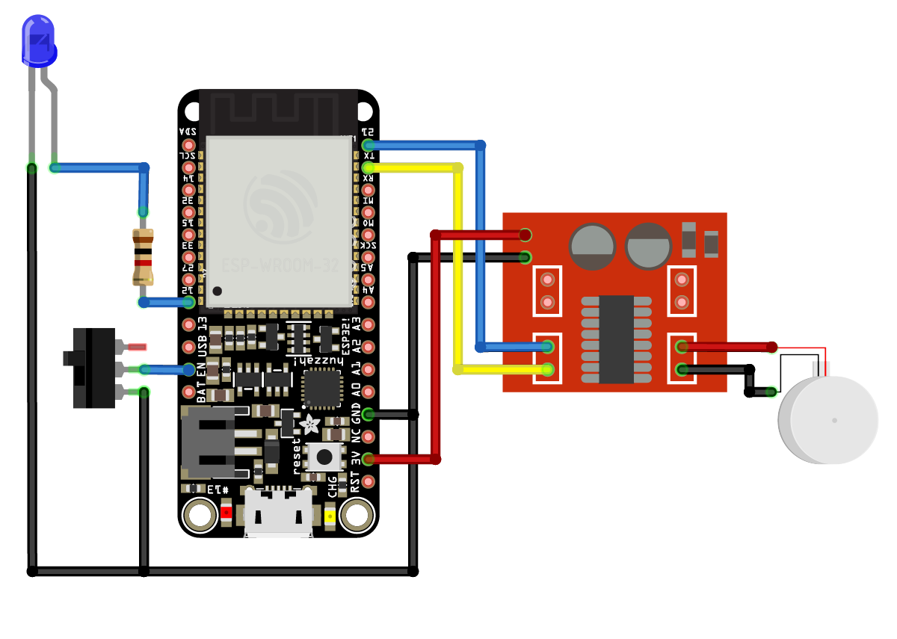

# Device Wheel

# Parts
* Adafruit HUZZAH32 – ESP32 Feather Board - https://www.adafruit.com/product/3405
* 3800 RPM 1.5mm Diameter Shaft 2V DC Motor for Walkman
* 1.5A Mini Speed Control Dual Channel Motor Driver MX1508
* SPDT Mini Power Switch - https://shop.pimoroni.com/products/spdt-mini-power-switch
* 3mm blue LED
* 1K Ohm resistor
* LiPo Battery Pack 3.7V 500mAh - https://shop.pimoroni.com/products/lipo-battery-pack?variant=20429082055
* Micro USB male to Micro USB female charge + data adapter cable