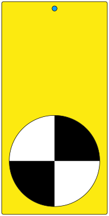

   
# Three WiFi Meters
The Three WiFi Meters are three ways of experiencing WiFi networks, each attempts to disclose properties of this near ubiquitous technology. They are built for the [ESP8266](https://en.wikipedia.org/wiki/ESP8266) or [ESP32](https://en.wikipedia.org/wiki/ESP32) making use of the [Approximate](https://github.com/davidchatting/Approximate) [Arduino](http://www.arduino.cc/download) library.

The meters works with 2.4GHz WiFi networks, but not 5GHz networks - as neither ESP8266 or ESP32 support this technology.

The Three WiFi Meters were created by David Chatting ([@davidchatting](https://twitter.com/davidchatting)) as part of the [A Network of One's Own](http://davidchatting.com/nooo/) project. This code is licensed under the [MIT License](LICENSE.txt).

##  Signal Strength

##  Device Wheel

##  Traffic Monitor