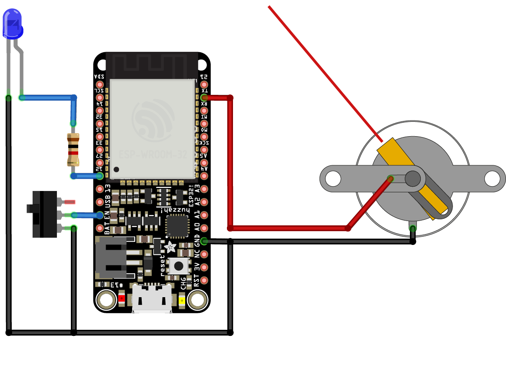

#  Signal Strength
Measure the signal strength of your router around the house with this Signal Strength Meter. Once the WiFi is configured by joining the "Home Network Study" network and setting the credentials via the captive portal, the analogue meter will reflect the signal strength (RSSI) of the router at that location.

## Hardware
* Adafruit HUZZAH32 – ESP32 Feather Board - https://www.adafruit.com/product/3405
* Eisco 0-30V Single Range Moving Coil Voltmeter - https://www.rapidonline.com/eisco-0-30v-single-range-moving-coil-voltmeter-52-3502 (series resistor needs to be removed)
* SPDT Mini Power Switch - https://shop.pimoroni.com/products/spdt-mini-power-switch
* 3mm blue LED
* 1K Ohm resistor
* LiPo Battery Pack 3.7V 500mAh - https://shop.pimoroni.com/products/lipo-battery-pack?variant=20429082055
* Micro USB male to Micro USB female charge + data adapter cable

The circuit shows an Adafruit HUZZAH32, but the code will compile for any ESP8266 or ESP32 (pin assignments will need to change of course).

## Software
### Arduino
The Arduino core for the ESP8266 or ESP32 must be installed for the Arduino IDE:
* ESP8266 - https://github.com/esp8266/Arduino#installing-with-boards-manager
* ESP32 - https://github.com/espressif/arduino-esp32/blob/master/docs/arduino-ide/boards_manager.md

And the Sketch Data Folder Uploader Tool:
* ESP8266 - https://randomnerdtutorials.com/install-esp8266-filesystem-uploader-arduino-ide/
* ESP32 - https://randomnerdtutorials.com/install-esp32-filesystem-uploader-arduino-ide/

And following Arduino libraries are required:
* Approximate - https://github.com/davidchatting/Approximate/
* YoYoWiFiManager - https://github.com/interactionresearchstudio/YoYoWiFiManager
* ListLib - https://github.com/luisllamasbinaburo/Arduino-List

From the *Tools* menu then select either `Generic ESP822 Module` or `ESP32 Dev Module` and then for the ESP8266 select `4MB (FS:3MB OTA:~512KB)` for *Flash Size* and for the ESP32 select a *Partition Scheme* of `Default 4MB with spiffs (1.2MB APP/1.5MB SPIFFS)` - assuming a *Flash Size* of 4MB. Then upload the associated `data` folder using the uploader tool - also found under the *Tools* menu. The data folder contains the HTML, JavaScript and image files for the captive portal that configures the WiFi. If you don't upload the data folder the portal will say, *Yo Yo Machines default HTML*.