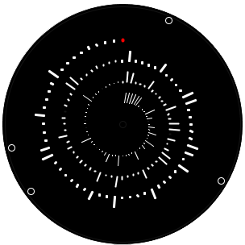
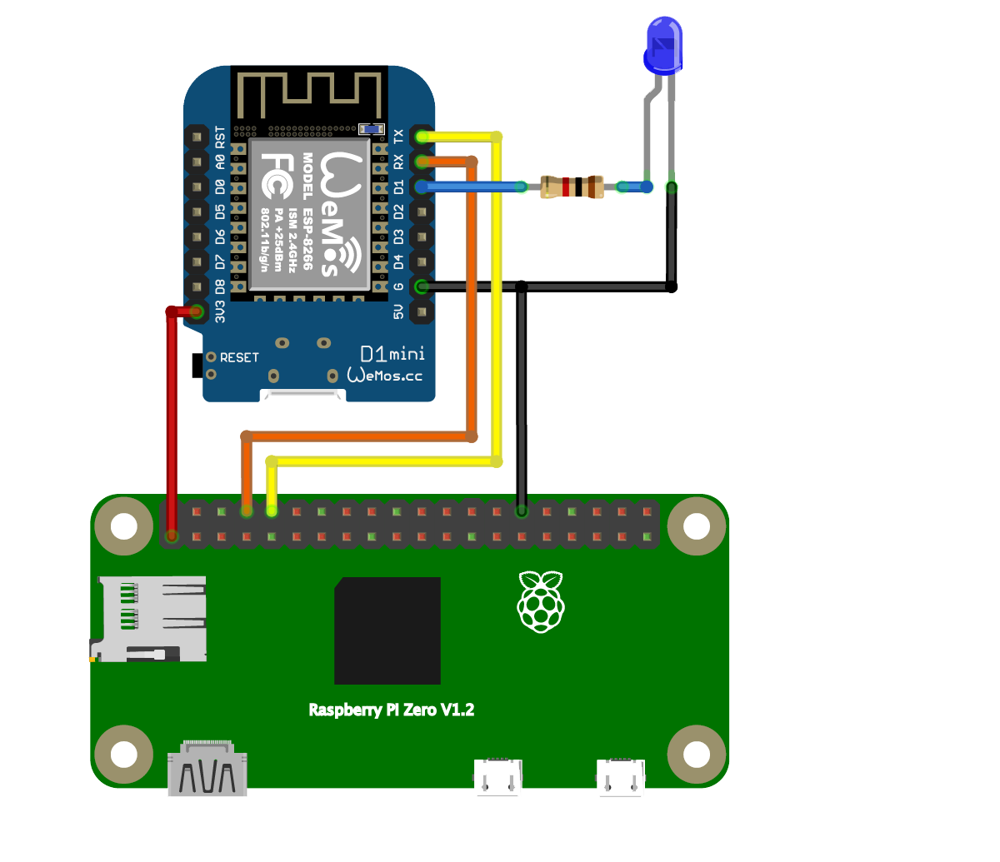

#  Traffic Monitor
See the traffic on your home WiFi network with this Traffic Monitor. Once the WiFi is configured by joining the "Home Network Study" network and setting the credentials via the captive portal, the last three minutes of network traffic will be displayed. The devices on the network are shown on the periphery of the circle and flash when they are active.



## Hardware
The ESP8266 monitors the network traffic and communicates over a serial connection with the Raspberry Pi, which renders the visualisation.

* Wemos D1 mini ESP8266 
* Raspberry Pi Zero - https://shop.pimoroni.com/products/raspberry-pi-zero-wh-with-pre-soldered-header
* Waveshare 4 inch Raspberry Pi Display - https://www.waveshare.com/wiki/4inch_RPi_LCD_(A)
* 3mm blue LED
* 1K Ohm resistor
* Micro USB male to Micro USB female charge + data adapter cable



The circuit shows a Wemos D1 mini ESP8266, but the code will compile for any ESP8266 or ESP32 (pin assignments will need to change of course).

## Software
### Arduino
The Arduino core for the ESP8266 or ESP32 must be installed for the Arduino IDE:
* ESP8266 - https://github.com/esp8266/Arduino#installing-with-boards-manager
* ESP32 - https://github.com/espressif/arduino-esp32/blob/master/docs/arduino-ide/boards_manager.md

And the Sketch Data Folder Uploader Tool:
* ESP8266 - https://randomnerdtutorials.com/install-esp8266-filesystem-uploader-arduino-ide/
* ESP32 - https://randomnerdtutorials.com/install-esp32-filesystem-uploader-arduino-ide/

And following Arduino libraries are required:
* Approximate - https://github.com/davidchatting/Approximate/
* YoYoWiFiManager - https://github.com/interactionresearchstudio/YoYoWiFiManager
* ListLib - https://github.com/luisllamasbinaburo/Arduino-List

From the *Tools* menu then select either `Generic ESP822 Module` or `ESP32 Dev Module` and then for the ESP8266 select `4MB (FS:3MB OTA:~512KB)` for *Flash Size* and for the ESP32 select a *Partition Scheme* of `Default 4MB with spiffs (1.2MB APP/1.5MB SPIFFS)` - assuming a *Flash Size* of 4MB. Then upload the associated `data` folder using the uploader tool - also found under the *Tools* menu. The data folder contains the HTML, JavaScript and image files for the captive portal that configures the WiFi. If you don't upload the data folder the portal will say, *Yo Yo Machines default HTML*.

### Processing
The visulisation code is built for [Processing 3](https://processing.org/) from a desktop this can be easily uploaded to the Raspberry Pi using the [Upload to Pi Tool](https://github.com/gohai/processing-uploadtopi). Alternatively, if the ESP8266 is attached to a desktop machine via USB then it can be run there instead - for platforms other than MacOS that might need some modifcation of ```looksLikeArduino()``` in the sketch.

## WiFi Set-up
The WiFi is configured by joining the *Home Network Study* network with the password *blinkblink* and entering the details of your network. If multiple meters are started once they will automaically discover each other and the set-up will shared between them. This is enabled by the [YoYoWiFiManager](https://github.com/interactionresearchstudio/YoYoWiFiManager).